# no-missing-csrf-protection

> **Keywords:** CSRF, CWE-352, security, ESLint rule, CSRF protection, token validation, middleware, Express, Fastify, LLM-optimized, code security

Detects missing CSRF token validation in POST/PUT/DELETE requests. This rule is part of [`@forge-js/eslint-plugin-llm-optimized`](https://www.npmjs.com/package/@forge-js/eslint-plugin-llm-optimized) and provides LLM-optimized error messages that AI assistants can automatically fix.

💼 This rule is set to **error** by default in the `recommended` config.

## Quick Summary

| Aspect            | Details                                                                          |
| ----------------- | -------------------------------------------------------------------------------- |
| **CWE Reference** | CWE-352 (Cross-Site Request Forgery)                                           |
| **Severity**      | HIGH (security vulnerability)                                                   |
| **Auto-Fix**      | ❌ No (requires manual CSRF middleware setup)                                   |
| **Category**      | Security                                                                         |
| **ESLint MCP**    | ✅ Optimized for ESLint MCP integration                                          |
| **Best For**      | All web applications with state-changing operations, Express, Fastify          |

## Detection Flow

```mermaid
%%{init: {
  'theme': 'base',
  'themeVariables': {
    'primaryColor': '#f8fafc',
    'primaryTextColor': '#1e293b',
    'primaryBorderColor': '#334155',
    'lineColor': '#475569'
  }
}}%%
flowchart TD
    A[🔍 Analyze Route Handler] --> B{Is POST/PUT/DELETE/PATCH?}
    B -->|No| C[✅ Valid: GET/HEAD/OPTIONS]
    B -->|Yes| D{Has CSRF Middleware?}
    D -->|Yes| E[✅ Valid: CSRF protected]
    D -->|No| F{Check Route Arguments}
    F --> G{CSRF in Arguments?}
    G -->|Yes| E
    G -->|No| H{Global CSRF?}
    H -->|Yes| E
    H -->|No| I[❌ Report: Missing CSRF]
    
    style C fill:#d1fae5,stroke:#059669,stroke-width:2px
    style E fill:#d1fae5,stroke:#059669,stroke-width:2px
    style I fill:#fee2e2,stroke:#dc2626,stroke-width:2px
```



## Why This Matters

| Issue                 | Impact                              | Solution                   |
| --------------------- | ----------------------------------- | -------------------------- |
| 🔒 **CSRF Attacks**  | Unauthorized state changes          | Add CSRF middleware        |
| 🔐 **Data Integrity**| Malicious requests from other sites | Validate CSRF tokens       |
| 🍪 **Session Hijack** | Exploit user sessions                | Use CSRF protection        |
| 📊 **Best Practice**  | All state-changing ops need CSRF     | Protect POST/PUT/DELETE    |

## Detection Patterns

The rule detects:

- **Express routes**: `app.post()`, `app.put()`, `app.delete()`, `app.patch()`
- **Route handlers without CSRF middleware** in arguments
- **Common CSRF middleware patterns**: `csrf`, `csurf`, `csrfProtection`, `validateCsrf`, `csrfToken`, `csrfMiddleware`
- **Global CSRF middleware**: Applied via `app.use(csrf())`

## Examples

### ❌ Incorrect

```typescript
// Missing CSRF protection on state-changing routes
app.post('/api/users', (req, res) => { // ❌ No CSRF middleware
  // Create user
});

router.put('/api/users/:id', (req, res) => { // ❌ No CSRF middleware
  // Update user
});

app.delete('/api/users/:id', handler); // ❌ No CSRF middleware
```

### ✅ Correct

```typescript
// CSRF middleware added
app.post('/api/users', csrf(), (req, res) => { // ✅ CSRF middleware
  // Create user
});

router.put('/api/users/:id', csrfProtection, (req, res) => { // ✅ CSRF middleware
  // Update user
});

// Global CSRF middleware
app.use(csrf({ cookie: true })); // ✅ Global protection
app.post('/api/users', (req, res) => { // ✅ Protected by global middleware
  // Create user
});

// GET requests don't need CSRF
app.get('/api/users', (req, res) => { // ✅ GET doesn't need CSRF
  // Return users
});
```

## Configuration

### Default Configuration

```json
{
  "@forge-js/llm-optimized/security/no-missing-csrf-protection": "error"
}
```

### Options

| Option                  | Type       | Default                          | Description                        |
| ----------------------- | ---------- | -------------------------------- | ----------------------------------- |
| `allowInTests`          | `boolean`  | `false`                          | Allow missing CSRF in tests         |
| `csrfMiddlewarePatterns`| `string[]` | `['csrf', 'csurf', ...]`        | CSRF middleware patterns           |
| `protectedMethods`      | `string[]` | `['post', 'put', 'delete', 'patch']` | HTTP methods requiring CSRF |
| `ignorePatterns`       | `string[]` | `[]`                             | Additional patterns to ignore       |

### Example Configuration

```json
{
  "@forge-js/llm-optimized/security/no-missing-csrf-protection": [
    "error",
    {
      "allowInTests": true,
      "csrfMiddlewarePatterns": ["csrf", "myCustomCsrf"],
      "protectedMethods": ["post", "put", "delete"],
      "ignorePatterns": ["/api/public"]
    }
  ]
}
```

## Best Practices

1. **Protect all state-changing routes**: POST, PUT, DELETE, PATCH
2. **Use middleware**: Leverage Express/Fastify CSRF middleware
3. **Global protection**: Apply CSRF middleware globally when possible
4. **Token validation**: Validate CSRF tokens on every protected request
5. **GET requests**: Don't require CSRF (idempotent operations)

## Related Rules

- [`no-insecure-cookie-settings`](./no-insecure-cookie-settings.md) - Detects insecure cookie configurations
- [`no-missing-authentication`](./no-missing-authentication.md) - Detects missing authentication

## Resources

- [CWE-352: Cross-Site Request Forgery](https://cwe.mitre.org/data/definitions/352.html)
- [OWASP: CSRF Prevention](https://owasp.org/www-community/attacks/csrf)
- [Express CSRF Protection](https://expressjs.com/en/advanced/best-practice-security.html#use-csrf-protection)

