# no-self-import

> **Keywords:** self-import, circular dependency, module resolution, bundler, import resolution, webpack, node.js, ESM, CommonJS, module isolation, dependency graph, import cycles, architecture

Disallow modules from importing themselves, preventing circular dependencies and import resolution issues. This rule supports multiple resolution strategies (bundler, node, simple) and provides configurable violation handling strategies.

## Quick Summary

| Aspect         | Details                                                                 |
| -------------- | ----------------------------------------------------------------------- |
| **Severity**   | High (architecture violation)                                           |
| **Auto-Fix**   | ✅ Yes (remove, comment strategies)                                      |
| **Category**   | Architecture                                                           |
| **ESLint MCP** | ✅ Optimized for ESLint MCP integration                                 |
| **Best For**   | Preventing circular dependencies and import resolution issues          |
| **Strategies** | Error, warn, remove, comment                                           |
| **Resolution** | Simple, bundler (webpack-style), node (node_modules-aware)             |

## Rule Details

```mermaid
%%{init: {
  'theme': 'base',
  'themeVariables': {
    'primaryColor': '#f8fafc',
    'primaryTextColor': '#1e293b',
    'primaryBorderColor': '#334155',
    'lineColor': '#475569',
    'c0': '#f8fafc',
    'c1': '#f1f5f9',
    'c2': '#e2e8f0',
    'c3': '#cbd5e1'
  }
}}%%
flowchart TD
    A[🔍 Detect Import/Require] --> B{Check ignoreExtensions}
    B -->|🟢 Ignored| C[✅ Skip]
    B -->|🔴 Not Ignored| D{Check allowInTests}
    D -->|🟢 Test file + allowed| C
    D -->|🔴 Not allowed| E[📍 Resolve import path]
    E --> F{Check resolutionStrategy}
    F -->|🔍 simple| G[Exact string match]
    F -->|📦 bundler| H[Webpack alias resolution]
    F -->|📁 node| I[Node.js module resolution]
    G --> J{Is self-import?}
    H --> J
    I --> J
    J -->|❌ No| C
    J -->|✅ Yes| K[🎯 Apply strategy]

    K --> L{Strategy type}
    L -->|🚨 error| M[Report violation]
    L -->|⚠️ warn| M
    L -->|🗑️ remove| N[Auto-fix: remove import]
    L -->|💬 comment| O[Auto-fix: comment out]

    classDef startNode fill:#f0fdf4,stroke:#16a34a,stroke-width:2px,color:#1f2937
    classDef errorNode fill:#fef2f2,stroke:#dc2626,stroke-width:2px,color:#1f2937
    classDef processNode fill:#eff6ff,stroke:#2563eb,stroke-width:2px,color:#1f2937

    class A startNode
    class M,N,O errorNode
    class K processNode
```



### Why This Matters

| Issue                | Impact                                | Solution                    |
| -------------------- | ------------------------------------- | --------------------------- |
| 🔄 **Circular deps** | Runtime errors, bundler failures     | Prevent self-references     |
| 🏗️ **Architecture**  | Poor module design, tight coupling    | Enforce module boundaries   |
| 📦 **Bundling**      | Build failures, infinite loops        | Static analysis prevention  |
| 🐛 **Debugging**     | Confusing stack traces, hard to trace | Clear violation detection   |

## Configuration

| Option                | Type                              | Default       | Description                                                                     |
| --------------------- | --------------------------------- | ------------- | ------------------------------------------------------------------------------- |
| `strategy`            | `'error' \| 'warn' \| 'remove' \| 'comment'` | `'error'`     | How to handle violations                                                        |
| `ignoreExtensions`    | `string[]`                        | `[]`          | File extensions to ignore (e.g., `['.d.ts']`)                                  |
| `resolutionStrategy`  | `'simple' \| 'bundler' \| 'node'` | `'simple'`    | Import path resolution method                                                   |
| `allowInTests`        | `boolean`                         | `false`       | Allow self-imports in test files                                                |
| `customResolver`      | `function`                        | `undefined`   | Custom import resolution function                                               |

### Strategy Comparison

| Strategy       | Behavior            | Use Case                    | Output                                     |
| -------------- | ------------------- | --------------------------- | ------------------------------------------ |
| 🚨 **error**   | Report as error     | Strict enforcement          | ESLint error, no auto-fix                  |
| ⚠️ **warn**    | Report as warning   | Development awareness       | ESLint warning, no auto-fix                |
| 🗑️ **remove**  | Auto-remove import  | Production cleanup          | `import './self'` → _(removed)_            |
| 💬 **comment** | Auto-comment import | Temporary debugging         | `import './self'` → `// import './self'`   |

### Resolution Strategy Comparison

| Strategy       | Behavior                          | Use Case                    | Example Match                              |
| -------------- | --------------------------------- | --------------------------- | ------------------------------------------ |
| 🔍 **simple**  | Exact string comparison          | Basic projects              | `'./utils'` matches `'./utils'`            |
| 📦 **bundler** | Webpack-style alias resolution    | Modern bundlers             | `'@utils/helper'` resolves to `'src/utils/helper'` |
| 📁 **node**    | Node.js module resolution         | Node.js projects            | Ignores `node_modules`, handles relative paths |

## Examples

### ❌ Incorrect

```typescript
// self-import.ts
import { helper } from './self-import'; // Self-import detected
export const helper = () => 'helper';

// Alternative syntax
const self = require('./self-import'); // Self-require detected
```

### ✅ Correct

```typescript
// utils.ts
export const helper = () => 'helper';

// app.ts
import { helper } from './utils'; // ✅ Correct import
console.log(helper());
```

## Configuration Examples

### Basic Usage (Default Strategy)

```javascript
// eslint.config.mjs
export default [
  {
    rules: {
      '@forge-js/no-self-import': 'error',
    },
  },
];
```

**Output Format:**
```
🏗️ Self Import | src/utils.ts:1 | Module imports itself
   Fix: Remove or comment out the self-import statement | https://github.com/import-js/eslint-plugin-import/blob/main/docs/rules/no-self-import.md
```

### Strategy: Remove (Production Cleanup)

```javascript
{
  rules: {
    '@forge-js/no-self-import': ['error', {
      strategy: 'remove'
    }]
  }
}
```

```typescript
// Before
import { helper } from './utils';
export const helper = () => 'helper';

// After (auto-fixed)
export const helper = () => 'helper';
```

### Strategy: Comment (Temporary Disable)

```javascript
{
  rules: {
    '@forge-js/no-self-import': ['warn', {
      strategy: 'comment'
    }]
  }
}
```

```typescript
// Before
import { data } from './api';
export const data = fetchData();

// After (auto-fixed)
// import { data } from './api';
export const data = fetchData();
```

### Bundler Resolution Strategy

```javascript
{
  rules: {
    '@forge-js/no-self-import': ['error', {
      resolutionStrategy: 'bundler',
      ignoreExtensions: ['.test.ts', '.spec.ts']
    }]
  }
}
```

**Detects webpack/vite-style aliases:**
```typescript
// webpack.config.js has: alias: { '@': path.resolve(__dirname, 'src') }

// In src/components/Button.ts
import { theme } from '@/utils/theme'; // ✅ Not a self-import
import { Button } from './Button';     // ❌ Self-import detected
```

### Node.js Resolution Strategy

```javascript
{
  rules: {
    '@forge-js/no-self-import': ['error', {
      resolutionStrategy: 'node',
      allowInTests: true
    }]
  }
}
```

**Ignores node_modules, handles relative resolution:**
```typescript
import React from 'react';           // ✅ Ignored (node_modules)
import { helper } from '../utils';    // ✅ Relative import (different file)
import { self } from './self';        // ❌ Self-import detected
```

### Ignore Specific Extensions

```javascript
{
  rules: {
    '@forge-js/no-self-import': ['error', {
      ignoreExtensions: ['.d.ts', '.test.ts'],
      strategy: 'warn'
    }]
  }
}
```

**Useful for TypeScript declaration files and test files:**
```typescript
// types.d.ts - ignored
import { MyType } from './types'; // ✅ Ignored due to .d.ts extension

// utils.test.ts - ignored
import { testHelper } from './utils'; // ✅ Ignored due to .test.ts extension
```

### Allow in Test Files

```javascript
{
  rules: {
    '@forge-js/no-self-import': ['error', {
      allowInTests: true,
      strategy: 'comment'
    }]
  }
}
```

**Auto-detects test files by filename:**
```typescript
// utils.test.ts - allowed
import { helper } from './utils'; // ✅ Allowed in test files

// __tests__/utils.spec.ts - allowed
import { mockData } from '../utils'; // ✅ Allowed in test directories
```

### Custom Resolver Function

```javascript
{
  rules: {
    '@forge-js/no-self-import': ['error', {
      customResolver: (importPath, currentFile) => {
        // Custom logic for determining if import resolves to current file
        return isSelfReference(importPath, currentFile);
      }
    }]
  }
}
```

## LLM-Optimized Output

The rule provides structured, actionable messages optimized for both humans and LLMs:

```
🏗️ Self Import | src/components/Button.ts:3 | Module imports itself
   Fix: Remove or comment out the self-import statement | https://github.com/import-js/eslint-plugin-import/blob/main/docs/rules/no-self-import.md
```

### Output Format Breakdown

| Component                          | Purpose    | Example                          |
| ---------------------------------- | ---------- | -------------------------------- |
| `🏗️ Self Import`                   | Issue type | Architecture violation          |
| `src/components/Button.ts:3`        | Location   | File path + line number          |
| `Module imports itself`            | Problem    | Clear description               |
| `Remove or comment out...`         | Solution   | Actionable fix instruction      |
| GitHub documentation link          | Reference  | Additional context              |

## Migration Patterns

### From Self-Referencing Code

```mermaid
%%{init: {
  'theme': 'base',
  'themeVariables': {
    'primaryColor': '#f8fafc',
    'primaryTextColor': '#1e293b',
    'primaryBorderColor': '#334155',
    'lineColor': '#475569',
    'actorBkg': '#f1f5f9',
    'actorBorder': '#334155',
    'actorTextColor': '#1e293b',
    'activationBorderColor': '#2563eb',
    'activationBkgColor': '#dbeafe',
    'sequenceNumberColor': '#1e293b',
    'noteBorderColor': '#334155',
    'noteBkgColor': '#fef3c7',
    'noteTextColor': '#1e293b'
  }
}}%%
sequenceDiagram
    participant Dev as 👨‍💻 Developer
    participant ESLint as 🔍 ESLint
    participant Code as 📝 Codebase

    Dev->>ESLint: Enable no-self-import with "remove" strategy
    ESLint->>Code: Scan for self-imports
    Code-->>ESLint: Found 12 self-import violations
    ESLint->>Dev: Report with auto-fix suggestions
    Dev->>ESLint: Apply auto-fix
    ESLint->>Code: Remove self-import statements
    Code-->>Dev: ✅ Migration complete

    Note over Dev,Code: All self-imports removed automatically
```



### Step-by-Step Refactoring

| Phase               | Configuration          | Goal                     |
| ------------------- | ---------------------- | ------------------------ |
| **1. Discovery**    | `strategy: 'warn'`     | Identify all violations  |
| **2. Review**       | Manual inspection      | Understand impact        |
| **3. Refactor**     | Extract shared code    | Fix architecture issues  |
| **4. Cleanup**      | `strategy: 'remove'`   | Auto-remove violations   |
| **5. Prevent**      | `strategy: 'error'`    | Prevent future issues    |

## Advanced Usage

### Monorepo Configuration

```javascript
// apps/web/eslint.config.mjs
{
  rules: {
    '@forge-js/no-self-import': ['error', {
      strategy: 'remove',
      resolutionStrategy: 'bundler',
      ignoreExtensions: ['.stories.ts']
    }]
  }
}

// apps/api/eslint.config.mjs
{
  rules: {
    '@forge-js/no-self-import': ['error', {
      strategy: 'comment',
      resolutionStrategy: 'node',
      allowInTests: true
    }]
  }
}
```

### CI/CD Integration

```yaml
# .github/workflows/lint.yml
- name: Lint and auto-fix
  run: |
    npm run lint -- --fix
    git diff --exit-code || echo "Self-import violations auto-fixed"
```

## When Not To Use

| Scenario          | Recommendation                                   |
| ----------------- | ------------------------------------------------ |
| **Prototyping**   | Disable or use `strategy: 'warn'`               |
| **Refactoring**   | Use `strategy: 'comment'` to temporarily disable |
| **Legacy code**   | Start with `allowInTests: true`                  |
| **Type files**    | Use `ignoreExtensions: ['.d.ts']`               |

## Comparison with Alternatives

| Feature              | no-self-import        | eslint-plugin-import | Manual review |
| -------------------- | --------------------- | -------------------- | ------------- |
| **Auto-Fix**         | ✅ Yes (4 strategies) | ❌ No                | ❌ No         |
| **Resolution strategies** | ✅ 3 types           | ⚠️ Limited          | ❌ No         |
| **Configurable behavior** | ✅ 4 strategies      | ❌ No                | ❌ No         |
| **LLM-Optimized**    | ✅ Yes                | ❌ No                | ❌ No         |
| **ESLint MCP**       | ✅ Optimized          | ❌ No                | ❌ No         |
| **Test file support** | ✅ Yes                | ❌ No                | ❌ No         |

## Error Message Format

This rule provides LLM-optimized error messages:

```
🏗️ Self Import | src/utils/helpers.ts:2 | Module imports itself
   Fix: Remove or comment out the self-import statement | https://github.com/import-js/eslint-plugin-import/blob/main/docs/rules/no-self-import.md
```

**Why this format?**

- **Structured** - AI assistants can parse and understand
- **Actionable** - Shows both problem and solution
- **Strategy-aware** - Indicates which remediation method to use
- **Auto-fixable** - AI can apply fixes automatically

## Further Reading

- **[ESLint Rules Documentation](https://eslint.org/docs/latest/rules/)** - Complete ESLint rules reference
- **[Circular Dependencies](https://en.wikipedia.org/wiki/Circular_dependency)** - Technical background
- **[Module Resolution](https://nodejs.org/api/modules.html#modules_all_together)** - Node.js module system
- **[Webpack Aliases](https://webpack.js.org/configuration/resolve/#resolvealias)** - Bundler configuration
- **[ESLint MCP Setup](https://eslint.org/docs/latest/use/mcp)** - Enable AI assistant integration
