# no-unhandled-promise

> **Keywords:** unhandled promise, promise rejection, async error handling, Promise, async/await, error handling, Node.js, JavaScript promises, async patterns, promise chains, try/catch, await, error propagation, CWE-1024, SonarQube RSPEC-4635

Disallow unhandled Promise rejections with LLM-optimized suggestions for proper async error handling. This rule detects promises that are created but never have their rejection handled, preventing silent failures in production applications.

## Quick Summary

| Aspect         | Details                                      |
| -------------- | -------------------------------------------- |
| **Severity**   | Error (production safety)                    |
| **Auto-Fix**   | ❌ No (complex logic)                         |
| **Category**   | Error Handling                               |
| **ESLint MCP** | ✅ Optimized for ESLint MCP integration      |
| **Best For**   | Production applications, async codebases     |
| **Suggestions** | ✅ Add .catch(), use try/catch, use await   |

## Rule Details

```mermaid
%%{init: {
  'theme': 'base',
  'themeVariables': {
    'primaryColor': '#f8fafc',
    'primaryTextColor': '#1e293b',
    'primaryBorderColor': '#334155',
    'lineColor': '#475569',
    'c0': '#f8fafc',
    'c1': '#f1f5f9',
    'c2': '#e2e8f0',
    'c3': '#cbd5e1'
  }
}}%%
flowchart TD
    A[🔍 Detect CallExpression] --> B{Could return Promise?}
    B -->|✅ Yes| C{In promise chain?}
    B -->|❌ No| D[✅ Skip]
    C -->|❌ No| E{Inside try/catch?}
    C -->|✅ Yes| D
    E -->|❌ No| F{Inside async function?}
    E -->|✅ Yes| D
    F -->|❌ No| G[🚨 Report unhandled promise]
    F -->|✅ Yes| H{Uses await?}
    H -->|❌ No| G
    H -->|✅ Yes| D

    classDef startNode fill:#f0fdf4,stroke:#16a34a,stroke-width:2px,color:#1f2937
    classDef errorNode fill:#fef2f2,stroke:#dc2626,stroke-width:2px,color:#1f2937
    classDef processNode fill:#eff6ff,stroke:#2563eb,stroke-width:2px,color:#1f2937

    class A startNode
    class G errorNode
    class D processNode
```



### Why This Matters

| Issue                | Impact                                | Solution                    |
| -------------------- | ------------------------------------- | --------------------------- |
| 🔒 **Silent Failures** | Errors swallowed without logging     | Proper error handling      |
| 🐛 **Debugging**     | Hard to trace async failures         | Centralized error handling |
| ⚡ **Reliability**   | Application crashes unexpectedly     | Graceful error recovery    |
| 📊 **Monitoring**    | No visibility into promise failures  | Error tracking & alerting  |

## Configuration

| Option                  | Type      | Default | Description                                  |
| ----------------------- | --------- | ------- | -------------------------------------------- |
| `ignoreInTests`         | `boolean` | `true`  | Skip promise checks in test files            |
| `ignoreVoidExpressions` | `boolean` | `false` | Skip promises in void expressions            |

## Examples

### ❌ Incorrect

```typescript
// Unhandled promise rejection
fetchUserData(userId);

// Promise chain without error handling
apiCall()
  .then(processData)
  .then(saveToDatabase);

// Async function without await or error handling
async function processOrder(orderId) {
  validateOrder(orderId); // Promise not handled
  return orderId;
}
```

### ✅ Correct

```typescript
// Handle with .catch()
fetchUserData(userId)
  .catch(error => {
    logger.error('Failed to fetch user data', { userId, error });
  });

// Complete promise chain
apiCall()
  .then(processData)
  .then(saveToDatabase)
  .catch(error => {
    logger.error('API pipeline failed', { error });
  });

// Use try/catch in async functions
async function processOrder(orderId) {
  try {
    await validateOrder(orderId);
    return orderId;
  } catch (error) {
    logger.error('Order validation failed', { orderId, error });
    throw error;
  }
}

// Or use await at the call site
async function handleOrder(orderId) {
  await processOrder(orderId); // Error will propagate
}
```

## Configuration Examples

### Basic Usage

```javascript
// eslint.config.mjs
export default [
  {
    rules: {
      '@forge-js/no-unhandled-promise': 'error',
    },
  },
];
```

### Ignore Test Files

```javascript
{
  rules: {
    '@forge-js/no-unhandled-promise': ['error', {
      ignoreInTests: true  // Default: true
    }]
  }
}
```

### Strict Mode (No Exceptions)

```javascript
{
  rules: {
    '@forge-js/no-unhandled-promise': ['error', {
      ignoreInTests: false,
      ignoreVoidExpressions: false
    }]
  }
}
```

## LLM-Optimized Output

```
🚨 CWE-1024 | Unhandled promise rejection detected | HIGH
   Fix: Add .catch() handler or use try/catch | https://rules.sonarsource.com/javascript/RSPEC-4635/

Suggestions:
  🔧 Add .catch(error => { ... })
  🔄 Use try/catch block
  ⚡ Use await in async function
```

## Advanced Usage

### Integration with Error Boundaries

```typescript
// React component with error boundary
class ErrorBoundary extends React.Component {
  componentDidCatch(error: Error, errorInfo: React.ErrorInfo) {
    // Handle async errors from promises
    logger.error('React error boundary caught error', {
      error: error.message,
      componentStack: errorInfo.componentStack
    });
  }
}

// Usage
<ErrorBoundary>
  <AsyncComponent />
</ErrorBoundary>
```

### Global Unhandled Rejection Handler

```typescript
// Global handler for truly unhandled rejections
process.on('unhandledRejection', (reason, promise) => {
  logger.error('Unhandled promise rejection', {
    reason,
    promise: promise.toString()
  });
  // Don't exit process in production
});
```

## When Not To Use

| Scenario         | Recommendation                   |
| ---------------- | -------------------------------- |
| 🧪 Prototyping   | Disable or use warning level     |
| 📚 Tutorials     | Add to ignorePatterns            |
| 🔧 Build Scripts | Use ignorePatterns: ['scripts']  |

## Comparison with Alternatives

| Feature              | no-unhandled-promise | eslint-plugin-promise | ESLint built-in |
| -------------------- | -------------------- | --------------------- | --------------- |
| **Promise Detection** | ✅ Static analysis   | ✅ Runtime checks     | ❌ No           |
| **Auto-Fix**         | ❌ No                | ❌ No                 | ❌ No           |
| **LLM-Optimized**    | ✅ Yes               | ❌ No                 | ❌ No           |
| **Customizable**     | ✅ Yes               | ⚠️ Limited           | ❌ No           |

## Error Message Format

```
🚨 CWE-1024 | Unhandled promise rejection detected | HIGH
   Fix: Add .catch() handler or use try/catch | https://rules.sonarsource.com/javascript/RSPEC-4635/
```

## Related Rules

- [`no-silent-errors`](./no-silent-errors.md) - Detects empty catch blocks
- [`no-missing-error-context`](./no-missing-error-context.md) - Requires error context information

## Further Reading

- **[Promise Error Handling](https://developer.mozilla.org/en-US/docs/Web/JavaScript/Guide/Using_promises#error_handling)** - MDN Promise error handling guide
- **[Async/Await Best Practices](https://developer.mozilla.org/en-US/docs/Learn/JavaScript/Asynchronous/Async_await)** - MDN async/await guide
- **[Node.js Error Handling](https://nodejs.org/api/errors.html)** - Node.js error handling documentation
