# no-unsanitized-html

> **Keywords:** XSS, cross-site scripting, CWE-79, security, ESLint rule, HTML injection, dangerouslySetInnerHTML, innerHTML, DOMPurify, sanitize-html, XSS prevention, auto-fix, LLM-optimized, code security

Detects unsanitized HTML injection (dangerouslySetInnerHTML, innerHTML) that can lead to Cross-Site Scripting (XSS) attacks. This rule is part of [`@forge-js/eslint-plugin-llm-optimized`](https://www.npmjs.com/package/@forge-js/eslint-plugin-llm-optimized) and provides LLM-optimized error messages that AI assistants can automatically fix.

⚠️ This rule **_errors_** by default in the `recommended` config (CRITICAL severity).

## Quick Summary

| Aspect            | Details                                                                          |
| ----------------- | -------------------------------------------------------------------------------- |
| **CWE Reference** | CWE-79 (Cross-site Scripting)                                                   |
| **Severity**      | Critical (security vulnerability)                                                |
| **Auto-Fix**      | ✅ Yes (suggests textContent or sanitization)                                     |
| **Category**      | Security                                                                         |
| **ESLint MCP**    | ✅ Optimized for ESLint MCP integration                                          |
| **Best For**      | All web applications rendering user-generated content, React apps, DOM manipulation |

## Rule Details

Unsanitized HTML injection is one of the most common web security vulnerabilities. This rule detects direct usage of `innerHTML` and `dangerouslySetInnerHTML` without proper sanitization, which can allow attackers to inject malicious scripts.

### Why This Matters

| Issue                 | Impact                              | Solution                   |
| --------------------- | ----------------------------------- | -------------------------- |
| 🔒 **Security**       | XSS attacks can steal user data     | Use textContent or sanitize |
| 🐛 **Data Theft**     | Cookies, tokens can be stolen       | DOMPurify, sanitize-html    |
| 🔐 **Session Hijack** | Attackers can hijack user sessions  | Proper HTML sanitization   |
| 📊 **Compliance**     | Violates security best practices     | Always sanitize user input  |

## Detection Patterns

The rule detects:

- **innerHTML**: Direct assignment to `element.innerHTML` without sanitization
- **dangerouslySetInnerHTML**: React prop without sanitization
- **Unsanitized HTML**: HTML content that hasn't been processed through a sanitization library

## Examples

### ❌ Incorrect

```typescript
// Unsanitized innerHTML
const userInput = '';
element.innerHTML = userInput; // ❌ XSS vulnerability

// Unsanitized dangerouslySetInnerHTML
function Component({ html }) {
  return <div dangerouslySetInnerHTML={{ __html: html }} />; // ❌ XSS vulnerability
}

// Direct HTML from user input
document.getElementById('container').innerHTML = userContent; // ❌ XSS vulnerability
```

### ✅ Correct

```typescript
// Using textContent (safest)
const userInput = '';
element.textContent = userInput; // ✅ Safe - HTML is escaped

// Sanitized with DOMPurify
import DOMPurify from 'dompurify';

const userInput = '';
element.innerHTML = DOMPurify.sanitize(userInput); // ✅ Safe - sanitized

// Sanitized dangerouslySetInnerHTML
function Component({ html }) {
  const sanitized = DOMPurify.sanitize(html);
  return <div dangerouslySetInnerHTML={{ __html: sanitized }} />; // ✅ Safe
}

// Using textContent in React
function Component({ content }) {
  return <div>{content}</div>; // ✅ Safe - React escapes by default
}
```

## Configuration

```javascript
{
  rules: {
    '@forge-js/llm-optimized/no-unsanitized-html': ['error', {
      allowInTests: false,                    // Allow in test files
      trustedLibraries: ['dompurify', 'sanitize-html', 'xss'], // Trusted sanitization libraries
      ignorePatterns: []                     // Additional safe patterns to ignore
    }]
  }
}
```

## Options

| Option              | Type       | Default                          | Description                                    |
| ------------------- | ---------- | -------------------------------- | ---------------------------------------------- |
| `allowInTests`      | `boolean`  | `false`                          | Allow unsanitized HTML in test files         |
| `trustedLibraries`  | `string[]` | `['dompurify', 'sanitize-html', 'xss']` | Trusted sanitization libraries to recognize     |
| `ignorePatterns`    | `string[]` | `[]`                             | Additional safe patterns to ignore              |

## Rule Logic Flow

```mermaid
%%{init: {
  'theme': 'base',
  'themeVariables': {
    'primaryColor': '#f8fafc',
    'primaryTextColor': '#1e293b',
    'primaryBorderColor': '#334155',
    'lineColor': '#475569',
    'c0': '#f8fafc',
    'c1': '#f1f5f9',
    'c2': '#e2e8f0',
    'c3': '#cbd5e1'
  }
}}%%
flowchart TD
    A[🔍 MemberExpression/JSXAttribute Found] --> B{In Test File?}
    B -->|Yes & allowInTests| C[✅ Skip]
    B -->|No| D{Matches Ignore Pattern?}
    D -->|Yes| C
    D -->|No| E{Check Pattern}
    E --> F{innerHTML?}
    F -->|Yes| G{Inside Sanitization Call?}
    F -->|No| H{dangerouslySetInnerHTML?}
    H -->|Yes| I{Value Sanitized?}
    H -->|No| C
    G -->|Yes| C
    G -->|No| J[🚨 Report Error]
    I -->|Yes| C
    I -->|No| J
    J --> K[💡 Suggest Fixes]
    K --> L[Use textContent]
    K --> M[Use DOMPurify]
    
    classDef startNode fill:#f0fdf4,stroke:#16a34a,stroke-width:2px,color:#1f2937
    classDef errorNode fill:#fef2f2,stroke:#dc2626,stroke-width:2px,color:#1f2937
    classDef processNode fill:#eff6ff,stroke:#2563eb,stroke-width:2px,color:#1f2937
    classDef skipNode fill:#f1f5f9,stroke:#64748b,stroke-width:2px,color:#1f2937
    
    class A startNode
    class J errorNode
    class E,F,G,H,I processNode
    class C skipNode
```



## Best Practices

### 1. Use textContent for Plain Text

```typescript
// ✅ Good - Safest option for plain text
const userInput = '<script>alert("XSS")</script>';
element.textContent = userInput; // HTML is automatically escaped
```

### 2. Use DOMPurify for HTML Content

```typescript
import DOMPurify from 'dompurify';

// ✅ Good - Sanitizes HTML while preserving safe tags
const userInput = '<p>Hello <strong>World</strong></p><script>alert("XSS")</script>';
element.innerHTML = DOMPurify.sanitize(userInput); // Removes <script> tag
```

### 3. Sanitize Before dangerouslySetInnerHTML

```typescript
import DOMPurify from 'dompurify';

function Component({ html }) {
  // ✅ Good - Sanitize before using dangerouslySetInnerHTML
  const sanitized = DOMPurify.sanitize(html);
  return <div dangerouslySetInnerHTML={{ __html: sanitized }} />;
}
```

### 4. Use React's Built-in Escaping

```typescript
// ✅ Good - React automatically escapes content
function Component({ content }) {
  return <div>{content}</div>; // Safe - React escapes HTML
}

// ❌ Bad - Bypasses React's escaping
function Component({ html }) {
  return <div dangerouslySetInnerHTML={{ __html: html }} />; // Dangerous
}
```

### 5. Configure DOMPurify for Your Use Case

```typescript
import DOMPurify from 'dompurify';

// ✅ Good - Configure allowed tags and attributes
const config = {
  ALLOWED_TAGS: ['b', 'i', 'em', 'strong', 'a', 'p'],
  ALLOWED_ATTR: ['href'],
};

const sanitized = DOMPurify.sanitize(userInput, config);
```

## Related Rules

- [`no-unvalidated-user-input`](./no-unvalidated-user-input.md) - Detects unvalidated user input
- [`no-unescaped-url-parameter`](./no-unescaped-url-parameter.md) - Detects unescaped URL parameters
- [`no-sql-injection`](./no-sql-injection.md) - Detects SQL injection vulnerabilities
- [`database-injection`](./database-injection.md) - Detects database injection vulnerabilities

## Resources

- [CWE-79: Cross-site Scripting](https://cwe.mitre.org/data/definitions/79.html)
- [OWASP XSS Prevention Cheat Sheet](https://cheatsheetseries.owasp.org/cheatsheets/Cross_Site_Scripting_Prevention_Cheat_Sheet.html)
- [DOMPurify Documentation](https://github.com/cure53/DOMPurify)
- [sanitize-html Documentation](https://github.com/apostrophecms/sanitize-html)
- [React Security Best Practices](https://react.dev/learn/escape-hatches)

