# prefer-dependency-version-strategy

> **Keywords:** dependency version, package.json, semantic versioning, caret, tilde, exact version, version strategy, ESLint rule, monorepo, dependency management, npm, pnpm, yarn, auto-fix, LLM-optimized, code quality

Enforce consistent version strategy (caret `^`, tilde `~`, exact, range, or any) for `package.json` dependencies. This rule complements `@nx/dependency-checks` by ensuring version specifier format consistency across your monorepo.

## Quick Summary

| Aspect         | Details                                                      |
| -------------- | ------------------------------------------------------------ |
| **Severity**   | Warning (best practice)                                      |
| **Auto-Fix**   | ✅ Yes (automatically adds/removes version prefixes)          |
| **Category**   | Development                                                  |
| **ESLint MCP** | ✅ Optimized for ESLint MCP integration                      |
| **Best For**   | Monorepos, teams standardizing dependency management          |
| **Strategies** | Caret (^), Tilde (~), Exact, Range, Any                    |

## Rule Details

```mermaid
%%{init: {
  'theme': 'base',
  'themeVariables': {
    'primaryColor': '#f8fafc',
    'primaryTextColor': '#1e293b',
    'primaryBorderColor': '#334155',
    'lineColor': '#475569',
    'c0': '#f8fafc',
    'c1': '#f1f5f9',
    'c2': '#e2e8f0',
    'c3': '#cbd5e1'
  }
}}%%
flowchart TD
    A[🔍 Check package.json] --> B{Check dependency type}
    B -->|dependencies| C[Validate version]
    B -->|devDependencies| C
    B -->|peerDependencies| C
    
    C --> D{Check protocol}
    D -->|workspace:| E[✅ Skip if allowWorkspace]
    D -->|file:| F[✅ Skip if allowFile]
    D -->|link:| G[✅ Skip if allowLink]
    D -->|semantic version| H{Check strategy}
    
    H -->|caret| I{Has ^ prefix?}
    H -->|tilde| J{Has ~ prefix?}
    H -->|exact| K{Has no prefix?}
    H -->|range| L{Has range operators?}
    
    I -->|❌ No| M[🔧 Auto-fix: Add ^]
    I -->|✅ Yes| N[✅ Pass]
    J -->|❌ No| O[🔧 Auto-fix: Add ~]
    J -->|✅ Yes| N
    K -->|❌ Has prefix| P[🔧 Auto-fix: Remove prefix]
    K -->|✅ No prefix| N
    L -->|❌ No| Q[🔧 Auto-fix: Suggest range]
    L -->|✅ Yes| N
    
    M --> R[📝 Report violation]
    O --> R
    P --> R
    Q --> R
    
    classDef startNode fill:#f0fdf4,stroke:#16a34a,stroke-width:2px,color:#1f2937
    classDef errorNode fill:#fef2f2,stroke:#dc2626,stroke-width:2px,color:#1f2937
    classDef processNode fill:#eff6ff,stroke:#2563eb,stroke-width:2px,color:#1f2937
    
    class A startNode
    class M,O,P,Q errorNode
    class R processNode
```



### Why This Matters

| Issue                | Impact                                    | Solution                    |
| -------------------- | ----------------------------------------- | --------------------------- |
| 🔄 **Consistency**   | Mixed version strategies cause confusion  | Standardize on one strategy |
| 🔒 **Security**      | Exact versions miss security patches      | Use caret for flexibility   |
| ⚡ **Maintenance**   | Hard to update dependencies systematically | Consistent strategy enables automation |
| 📦 **Monorepo**      | Different packages use different strategies | Unified approach across packages |

## Configuration

| Option          | Type                                      | Default | Description                                                                 |
| --------------- | ----------------------------------------- | ------- | --------------------------------------------------------------------------- |
| `strategy`      | `'caret' \| 'tilde' \| 'exact' \| 'range' \| 'any'` | `'caret'` | Default version strategy to enforce for all packages                       |
| `allowWorkspace` | `boolean`                                 | `true`  | Allow `workspace:` protocol versions (monorepo support)                     |
| `allowFile`     | `boolean`                                 | `true`  | Allow `file:` protocol versions                                            |
| `allowLink`     | `boolean`                                 | `true`  | Allow `link:` protocol versions                                            |
| `overrides`     | `Record<string, VersionStrategy>`        | `{}`    | Package-specific strategy overrides. Key is package name, value is strategy |

### Strategy Options

| Strategy | Prefix | Description                                    | Example        |
| -------- | ------ | ---------------------------------------------- | -------------- |
| `caret`  | `^`    | Allows minor and patch updates (recommended)   | `^1.0.0`       |
| `tilde`  | `~`    | Allows only patch updates                      | `~1.0.0`       |
| `exact`  | none   | Requires exact version match                   | `1.0.0`        |
| `range`  | `>=`, `<`, `\|\|` | Allows range operators                      | `>=1.0.0 <2.0.0` |
| `any`    | any    | Allows any version format (disables rule)     | Any format     |

## Examples

### ❌ Incorrect

```json
{
  "dependencies": {
    "react": "18.2.0",           // Missing caret
    "lodash": "~4.17.21",        // Using tilde when caret expected
    "typescript": "^5.0.0"       // Correct
  }
}
```

### ✅ Correct

```json
{
  "dependencies": {
    "react": "^18.2.0",          // Caret prefix
    "lodash": "^4.17.21",        // Caret prefix
    "typescript": "^5.0.0"       // Caret prefix
  }
}
```

### Monorepo Support

```json
{
  "dependencies": {
    "@my-org/utils": "workspace:*",     // ✅ Allowed (workspace protocol)
    "@my-org/shared": "file:../shared", // ✅ Allowed (file protocol)
    "external-lib": "^1.0.0"           // ✅ Enforced strategy
  }
}
```

## Usage

### Basic Configuration

```javascript
// eslint.config.mjs
import llmOptimized from '@forge-js/eslint-plugin-llm-optimized';

export default [
  {
    files: ['**/package.json'],
    plugins: {
      '@forge-js/llm-optimized': llmOptimized,
    },
    rules: {
      '@forge-js/llm-optimized/development/prefer-dependency-version-strategy': [
        'warn',
        {
          strategy: 'caret',
          allowWorkspace: true,
          allowFile: true,
          allowLink: true,
        },
      ],
    },
    languageOptions: {
      parser: await import('jsonc-eslint-parser'),
    },
  },
];
```

### Custom Strategy

```javascript
// Enforce exact versions (strict)
{
  '@forge-js/llm-optimized/development/prefer-dependency-version-strategy': [
    'error',
    { strategy: 'exact' }
  ]
}

// Enforce tilde (patch updates only)
{
  '@forge-js/llm-optimized/development/prefer-dependency-version-strategy': [
    'warn',
    { strategy: 'tilde' }
  ]
}
```

### Package-Specific Overrides

Override the default strategy for specific packages. This allows you to have strict versioning for critical dependencies while maintaining flexibility for others.

#### Basic Override Example

```javascript
{
  '@forge-js/llm-optimized/development/prefer-dependency-version-strategy': [
    'warn',
    {
      strategy: 'caret', // Default: use caret for all packages
      overrides: {
        'react': 'exact',        // React must be exact version
        'react-dom': 'exact',    // React DOM must be exact version
        'lodash': 'tilde',       // Lodash uses tilde (patch updates only)
        'typescript': 'exact',   // TypeScript must be exact version
        '@types/node': 'caret',  // Type definitions can use caret
      }
    }
  ]
}
```

#### Real-World React Project Example

```javascript
{
  '@forge-js/llm-optimized/development/prefer-dependency-version-strategy': [
    'warn',
    {
      strategy: 'caret',
      overrides: {
        // Core framework - exact versions for stability
        'react': 'exact',
        'react-dom': 'exact',
        'next': 'exact',
        
        // Build tools - exact versions
        'typescript': 'exact',
        'vite': 'exact',
        'esbuild': 'exact',
        
        // Utility libraries - tilde (patch updates only)
        'lodash': 'tilde',
        'date-fns': 'tilde',
        'ramda': 'tilde',
        
        // Type definitions - caret (flexible)
        '@types/react': 'caret',
        '@types/node': 'caret',
        '@types/lodash': 'caret',
      }
    }
  ]
}
```

#### Monorepo Example with Workspace Support

```javascript
{
  '@forge-js/llm-optimized/development/prefer-dependency-version-strategy': [
    'warn',
    {
      strategy: 'caret',
      allowWorkspace: true, // Allow workspace: protocol
      overrides: {
        // Shared dependencies - exact versions
        'typescript': 'exact',
        '@types/node': 'exact',
        
        // Framework - exact
        'react': 'exact',
        
        // Utilities - tilde
        'lodash': 'tilde',
      }
    }
  ]
}
```

**Use Cases:**
- **Critical dependencies** (React, TypeScript, Next.js): Use `exact` to prevent breaking changes
- **Utility libraries** (lodash, date-fns): Use `tilde` for patch updates only
- **Type definitions** (@types/*): Use `caret` for flexibility
- **Most packages**: Use default `caret` strategy
- **Disable for specific packages**: Use `'any'` to allow any version format

## Integration with @nx/dependency-checks

This rule **complements** `@nx/dependency-checks`:

| Rule                          | Purpose                                    |
| ----------------------------- | ------------------------------------------ |
| `@nx/dependency-checks`       | Validates version alignment with lockfile  |
| `prefer-dependency-version-strategy` | Enforces version prefix format consistency |

**Use both together:**

```javascript
{
  rules: {
    '@nx/dependency-checks': ['error', { /* ... */ }],
    '@forge-js/llm-optimized/development/prefer-dependency-version-strategy': [
      'warn',
      { strategy: 'caret' }
    ],
  },
}
```

## Auto-Fix Examples

### Example 1: With Package-Specific Overrides

**Configuration:**
```javascript
{
  strategy: 'caret', // Default for all packages
  overrides: {
    'react': 'exact',        // React must be exact
    'react-dom': 'exact',    // React DOM must be exact
    'lodash': 'tilde',       // Lodash uses tilde
    'typescript': 'exact',   // TypeScript must be exact
  }
}
```

**Before (Incorrect):**
```json
{
  "dependencies": {
    "react": "^18.2.0",           // ❌ Should be exact
    "react-dom": "^18.2.0",       // ❌ Should be exact
    "lodash": "^4.17.21",        // ❌ Should be tilde
    "typescript": "^5.0.0",      // ❌ Should be exact
    "express": "4.18.0",         // ❌ Missing caret (default)
    "axios": "1.6.0"             // ❌ Missing caret (default)
  }
}
```

**After (Auto-Fixed):**
```json
{
  "dependencies": {
    "react": "18.2.0",           // ✅ Exact (override)
    "react-dom": "18.2.0",       // ✅ Exact (override)
    "lodash": "~4.17.21",        // ✅ Tilde (override)
    "typescript": "5.0.0",       // ✅ Exact (override)
    "express": "^4.18.0",        // ✅ Caret (default)
    "axios": "^1.6.0"            // ✅ Caret (default)
  }
}
```

### Example 2: React Project with Strict Versioning

**Configuration:**
```javascript
{
  strategy: 'caret', // Default: flexible for most packages
  overrides: {
    // Core React dependencies - exact versions
    'react': 'exact',
    'react-dom': 'exact',
    'react-router-dom': 'exact',
    
    // Build tools - exact versions
    'typescript': 'exact',
    'vite': 'exact',
    
    // Utility libraries - tilde (patch updates only)
    'lodash': 'tilde',
    'date-fns': 'tilde',
    
    // Type definitions - caret (flexible)
    '@types/react': 'caret',
    '@types/node': 'caret',
  }
}
```

**Before:**
```json
{
  "dependencies": {
    "react": "^18.2.0",
    "react-dom": "^18.2.0",
    "react-router-dom": "^6.20.0",
    "typescript": "^5.3.0",
    "vite": "^5.0.0",
    "lodash": "^4.17.21",
    "date-fns": "^2.30.0",
    "@types/react": "18.2.0",
    "@types/node": "20.10.0"
  }
}
```

**After (Auto-Fixed):**
```json
{
  "dependencies": {
    "react": "18.2.0",              // ✅ Exact
    "react-dom": "18.2.0",          // ✅ Exact
    "react-router-dom": "6.20.0",    // ✅ Exact
    "typescript": "5.3.0",          // ✅ Exact
    "vite": "5.0.0",                // ✅ Exact
    "lodash": "~4.17.21",           // ✅ Tilde
    "date-fns": "~2.30.0",          // ✅ Tilde
    "@types/react": "^18.2.0",      // ✅ Caret (default)
    "@types/node": "^20.10.0"      // ✅ Caret (default)
  }
}
```

### Example 3: Monorepo with Mixed Strategies

**Configuration:**
```javascript
{
  strategy: 'caret', // Default
  allowWorkspace: true,
  overrides: {
    // Critical shared dependencies - exact
    'typescript': 'exact',
    '@types/node': 'exact',
    
    // Framework packages - exact
    'react': 'exact',
    'next': 'exact',
    
    // Utility packages - tilde
    'lodash': 'tilde',
    'ramda': 'tilde',
  }
}
```

**Before:**
```json
{
  "dependencies": {
    "@my-org/shared": "workspace:*",  // ✅ Allowed (workspace protocol)
    "typescript": "^5.0.0",           // ❌ Should be exact
    "@types/node": "^20.0.0",        // ❌ Should be exact
    "react": "^18.2.0",               // ❌ Should be exact
    "next": "^14.0.0",                // ❌ Should be exact
    "lodash": "^4.17.21",             // ❌ Should be tilde
    "ramda": "^0.29.0",               // ❌ Should be tilde
    "axios": "1.6.0",                 // ❌ Missing caret (default)
    "express": "4.18.0"               // ❌ Missing caret (default)
  }
}
```

**After (Auto-Fixed):**
```json
{
  "dependencies": {
    "@my-org/shared": "workspace:*",  // ✅ Allowed (workspace protocol)
    "typescript": "5.0.0",            // ✅ Exact (override)
    "@types/node": "20.0.0",         // ✅ Exact (override)
    "react": "18.2.0",                // ✅ Exact (override)
    "next": "14.0.0",                 // ✅ Exact (override)
    "lodash": "~4.17.21",             // ✅ Tilde (override)
    "ramda": "~0.29.0",               // ✅ Tilde (override)
    "axios": "^1.6.0",                // ✅ Caret (default)
    "express": "^4.18.0"              // ✅ Caret (default)
  }
}
```

### Example 4: Simple Configuration (No Overrides)

**Configuration:**
```javascript
{
  strategy: 'caret', // Default for all packages
}
```

**Before:**
```json
{
  "dependencies": {
    "typescript": "5.0.0",
    "lodash": "4.17.21",
    "express": "4.18.0"
  }
}
```

**After (Default caret strategy):**
```json
{
  "dependencies": {
    "typescript": "^5.0.0",
    "lodash": "^4.17.21",
    "express": "^4.18.0"
  }
}
```

### Example 5: Disable Rule for Specific Packages

**Configuration:**
```javascript
{
  strategy: 'caret',
  overrides: {
    'experimental-package': 'any',  // Allow any version format
    'legacy-package': 'any',        // Allow any version format
  }
}
```

**Result:**
- `experimental-package` and `legacy-package` can use any version format (exact, caret, tilde, range, etc.)
- All other packages must use caret (`^`) prefix

## Best Practices

| Practice                    | Reason                                    |
| --------------------------- | ----------------------------------------- |
| ✅ Use `caret` (default)   | Allows security patches and minor updates |
| ✅ Use `overrides` for critical deps | Pin React, TypeScript, etc. to exact versions |
| ✅ Allow workspace protocols | Essential for monorepo support            |
| ✅ Combine with @nx/dependency-checks | Complete dependency validation |
| ⚠️ Avoid `exact` for all packages | Misses security patches                  |
| ⚠️ Use `exact` only for critical deps | When version pinning is required |
| 💡 Use `tilde` for utilities | Patch updates only (lodash, date-fns) |

### Recommended Override Patterns

```javascript
{
  strategy: 'caret', // Default: flexible for most packages
  overrides: {
    // Critical framework dependencies - exact versions
    'react': 'exact',
    'react-dom': 'exact',
    'typescript': 'exact',
    
    // Utility libraries - tilde (patch updates only)
    'lodash': 'tilde',
    'date-fns': 'tilde',
    
    // Type definitions - caret (flexible)
    '@types/node': 'caret',
    '@types/react': 'caret',
  }
}
```

## Related Rules

- [`@nx/dependency-checks`](https://nx.dev/packages/eslint-plugin/documents/dependency-checks) - Validates dependency versions against lockfile
- [`no-console-log`](./no-console-log.md) - Disallow console.log statements

## Resources

- [npm Semantic Versioning](https://docs.npmjs.com/cli/v10/configuring-npm/package-json#dependencies)
- [Semantic Versioning Specification](https://semver.org/)
- [Nx Dependency Checks](https://nx.dev/packages/eslint-plugin/documents/dependency-checks)

## Version History

- **1.0.0** - Initial release with caret, tilde, exact, range, and any strategies

