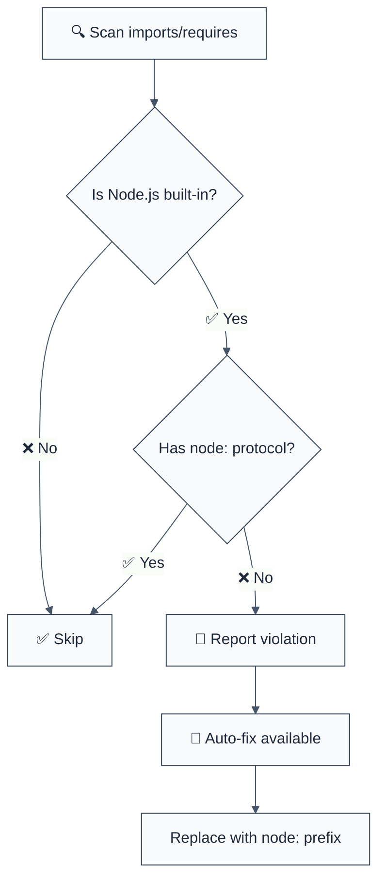

# prefer-node-protocol

> **Keywords:** Node.js protocol, built-in modules, import protocol, node: protocol, ES modules, CommonJS, module resolution, Node.js best practices, import statements, require calls

Enforce using the `node:` protocol when importing Node.js builtin modules. This rule is inspired by [`eslint-plugin-unicorn`](https://github.com/sindresorhus/eslint-plugin-unicorn/blob/main/docs/rules/prefer-node-protocol.md) and ensures modern Node.js import patterns.

## Quick Summary

| Aspect         | Details                                           |
| -------------- | ------------------------------------------------- |
| **Severity**   | Warning (convention)                              |
| **Auto-Fix**   | ✅ Yes (transforms imports and requires)          |
| **Category**   | Architecture                                      |
| **ESLint MCP** | ✅ Optimized for ESLint MCP integration           |
| **Best For**   | Modern Node.js applications, monorepo consistency |
| **Modules**    | All Node.js built-ins (fs, path, crypto, etc.)    |

## Rule Details



### What This Rule Does

This rule enforces the modern Node.js convention of using the `node:` protocol for built-in modules:

#### ❌ Incorrect Code

```javascript
// ES modules
import fs from "fs";
import path from "path";
import crypto from "crypto";

// CommonJS
const fs = require("fs");
const path = require("path");
const crypto = require("crypto");

// Dynamic imports
const fs = await import("fs");
```

#### ✅ Correct Code

```javascript
// ES modules
import fs from "node:fs";
import path from "node:path";
import crypto from "node:crypto";

// CommonJS
const fs = require("node:fs");
const path = require("node:path");
const crypto = require("node:crypto");

// Dynamic imports
const fs = await import("node:fs");
```

### Why This Matters

| Reason | Impact |
| ------ | ------ |
| **Future-proofing** | Node.js recommends `node:` protocol for built-ins |
| **Clarity** | Explicitly distinguishes built-ins from npm packages |
| **Consistency** | Modern Node.js best practice across the ecosystem |
| **Resolution safety** | Avoids potential conflicts with local modules named `fs`, `path`, etc. |

## Configuration

### Basic Configuration

```javascript
{
  "@forge-js/llm-optimized/prefer-node-protocol": "warn"
}
```

### Advanced Configuration

```javascript
{
  "@forge-js/llm-optimized/prefer-node-protocol": [
    "warn",
    {
      "additionalModules": ["my-builtin-module"]
    }
  ]
}
```

### Options

| Option | Type | Default | Description |
| ------ | ---- | ------- | ----------- |
| `additionalModules` | `string[]` | `[]` | Additional module names to treat as requiring `node:` protocol |

## Examples

### Basic Usage

```javascript
// .eslintrc.js
module.exports = {
  plugins: ["@forge-js/llm-optimized"],
  rules: {
    "@forge-js/llm-optimized/prefer-node-protocol": "warn"
  }
};
```

### With Additional Modules

```javascript
// .eslintrc.js
module.exports = {
  plugins: ["@forge-js/llm-optimized"],
  rules: {
    "@forge-js/llm-optimized/prefer-node-protocol": [
      "warn",
      {
        additionalModules: ["my-company-builtins"]
      }
    ]
  }
};
```

## Supported Node.js Built-in Modules

The rule automatically detects all Node.js built-in modules:

- `assert`, `async_hooks`, `buffer`, `child_process`
- `cluster`, `console`, `constants`, `crypto`
- `dgram`, `diagnostics_channel`, `dns`, `domain`
- `events`, `fs`, `http`, `http2`, `https`
- `inspector`, `module`, `net`, `os`, `path`
- `perf_hooks`, `process`, `punycode`, `querystring`
- `readline`, `repl`, `stream`, `string_decoder`
- `sys`, `timers`, `tls`, `trace_events`, `tty`
- `url`, `util`, `v8`, `vm`, `wasi`, `worker_threads`, `zlib`

### Sub-path Support

The rule also handles sub-path imports:

```javascript
// ❌ Incorrect
import { promises } from "fs";
import posix from "path/posix";

// ✅ Correct
import { promises } from "node:fs";
import posix from "node:path/posix";
```

## Error Messages

### Primary Error

```
⚠️ Use node: protocol for built-in modules | MEDIUM
   Fix: Change "fs" to "node:fs" in import | https://nodejs.org/api/modules.html#modules_node_imports
```

### LLM-Optimized Context

The rule provides structured error messages designed for AI assistants:

- **Problem identification**: Clear explanation of the issue
- **Fix suggestion**: Exact code transformation needed
- **Documentation link**: Official Node.js documentation reference
- **Severity level**: MEDIUM (convention/best practice)

## Auto-Fix Behavior

### Supported Transformations

| Input | Output |
| ----- | ------ |
| `import fs from "fs"` | `import fs from "node:fs"` |
| `const fs = require("fs")` | `const fs = require("node:fs")` |
| `import("fs")` | `import("node:fs")` |

### Fix Reliability

- **100% safe**: Only transforms string literals
- **No side effects**: Pure syntax transformation
- **Idempotent**: Running multiple times produces same result
- **Comprehensive**: Handles ES modules, CommonJS, and dynamic imports

## When To Disable

### Valid Disable Cases

```javascript
// eslint-disable-next-line @forge-js/llm-optimized/prefer-node-protocol
import fs from "fs"; // Legacy code compatibility

// eslint-disable-next-line @forge-js/llm-optimized/prefer-node-protocol
const path = require("path"); // Third-party tool requirement
```

### When To Consider Disabling

- **Legacy codebases**: Gradual migration path
- **Build tool constraints**: Some bundlers may not support `node:` protocol
- **Node.js version compatibility**: Required Node.js 14.18.0+ for `node:` protocol

## Integration with Other Rules

### Complementary Rules

- **`no-internal-modules`**: Prevents deep module imports
- **`no-cross-domain-imports`**: Enforces import boundaries
- **`enforce-dependency-direction`**: Controls import direction

### Rule Interactions

```javascript
{
  "rules": {
    "@forge-js/llm-optimized/prefer-node-protocol": "warn",
    "@forge-js/llm-optimized/no-internal-modules": "warn",
    "@forge-js/llm-optimized/no-cross-domain-imports": "error"
  }
}
```

## Performance Impact

| Metric | Value |
| ------ | ----- |
| **Linting overhead** | < 5ms per file |
| **Memory usage** | Minimal (static module list) |
| **AST traversal** | Single pass |
| **Fix application** | Instant (string replacement) |

## Troubleshooting

### Common Issues

#### "Rule not detecting my imports"

**Problem**: Custom module resolution or non-standard import syntax

**Solution**: Ensure you're using standard ES modules or CommonJS syntax

```javascript
// ✅ Works
import fs from "fs";
const fs = require("fs");

// ❌ Doesn't work
const fs = customImport("fs");
```

#### "Auto-fix not working"

**Problem**: Complex import expressions or template literals

**Solution**: The rule only fixes string literal imports. For dynamic cases:

```javascript
// Manual fix required
const moduleName = "fs";
const fs = require(`node:${moduleName}`);
```

### Node.js Version Compatibility

- **Node.js 14.18.0+**: Full `node:` protocol support
- **Node.js < 14.18.0**: Protocol not supported, disable rule
- **All versions**: Rule will still detect violations but fixes may not work

## Migration Guide

### Gradual Adoption

```javascript
// Phase 1: Detect violations (warnings)
{
  "@forge-js/llm-optimized/prefer-node-protocol": "warn"
}

// Phase 2: Enforce (errors)
{
  "@forge-js/llm-optimized/prefer-node-protocol": "error"
}
```

### Large Codebase Migration

1. **Enable rule as warnings**: Let team see violations
2. **Use auto-fix**: `eslint --fix` for automatic migration
3. **Manual review**: Check edge cases and complex imports
4. **Enable as errors**: Prevent new violations

## Related Rules

### Similar Rules in Other Plugins

- **`unicorn/prefer-node-protocol`**: Original inspiration
- **`node/no-deprecated-api`**: Prevents deprecated Node.js APIs
- **`import/no-nodejs-modules`**: Related import restrictions

### Complementary Rules

```javascript
{
  "rules": {
    "@forge-js/llm-optimized/prefer-node-protocol": "warn",
    "node/no-deprecated-api": "error",
    "@forge-js/llm-optimized/no-unsafe-dynamic-require": "error"
  }
}
```

## Examples in the Wild

### Express.js Application

```javascript
// Before
import express from "express";
import path from "path";
import fs from "fs";

// After
import express from "express";
import path from "node:path";
import fs from "node:fs";
```

### Build Tool Configuration

```javascript
// Before
const fs = require("fs");
const path = require("path");
const crypto = require("crypto");

// After
const fs = require("node:fs");
const path = require("node:path");
const crypto = require("node:crypto");
```

## Contributing

Found a bug or want to improve this rule? See our [contributing guide](../../CONTRIBUTING.md).

### Testing

The rule includes comprehensive test coverage:

- ✅ ES module imports (`import fs from "fs"`)
- ✅ CommonJS requires (`require("fs")`)
- ✅ Dynamic imports (`import("fs")`)
- ✅ Sub-path imports (`"fs/promises"`)
- ✅ Configuration options
- ✅ Edge cases and error handling

### Future Enhancements

- **TypeScript path mapping**: Integration with `tsconfig.json` paths
- **Custom protocol support**: Support for other protocols (`file:`, `data:`)
- **Import assertion detection**: Handle `import fs from "fs" assert { type: "json" }`

---

## References

- [Node.js ES Modules Documentation](https://nodejs.org/api/modules.html#modules_node_imports)
- [ESLint Plugin Unicorn](https://github.com/sindresorhus/eslint-plugin-unicorn)
- [Node.js Built-in Modules](https://nodejs.org/api/modules.html#modules_nodejs_builtin_modules)

---

*This rule helps modernize Node.js codebases and ensures consistency with current Node.js best practices.*
